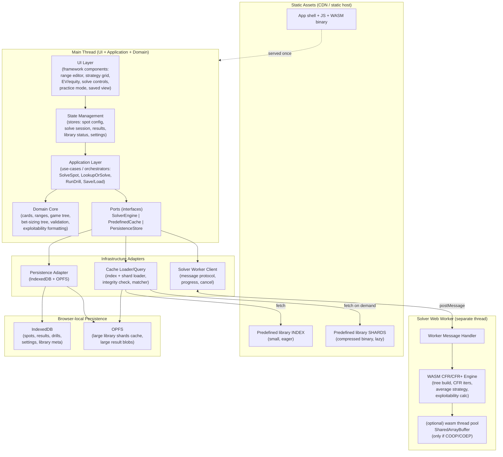

# Architecture — Personal Browser-Native NLHE GTO Solver ("ClearSolve")

> Owner: Software Architect Agent
> Last Updated: 2026-06-24
> Status: DRAFT for stakeholder review (some choices are approval-gate items — see TECH_DECISIONS.md Section "Approval Gates")
> Source of truth: `PRD.md`, `USER_STORIES.md`, `ACCEPTANCE_CRITERIA.md`, `RISKS.md`
> Companion docs: `TECH_DECISIONS.md` (ADRs), `DATA_MODEL.md` (schemas), `API_SPEC.md` (internal interfaces)

This document defines HOW the system is built. It does not implement code. Cross-references to PRD features (FEAT-*), requirements (REQ-*), business rules (BR-*), NFRs, edge cases (EDGE-*), and risks (RISK-*) are inline.

---

## 1. Overview

ClearSolve is a **pure client-side Single-Page Application (SPA)** that functions as a personal No-Limit Texas Hold'em GTO study tool. It is built around three cooperating capabilities, all running in the browser with no backend (CON-2):

1. A **live CFR/CFR+ solver engine** compiled to **WebAssembly (WASM)**, running off the main thread in a **Web Worker** (CON-1, FEAT-001, REQ-001/002).
2. A **bundled predefined-solution cache** — high-quality solutions precomputed **offline** and shipped as static assets, served instantly on a match (FEAT-019, REQ-018), with **automatic live-solve fallback** for novel spots (REQ-019, BR-008).
3. A **practice/drill mode** that draws spots from the cache or the user's saved solves and scores recall against the GTO solution (FEAT-012, REQ-021).

The product ships as static files (HTML/JS/WASM + the predefined library). Everything else — compute, persistence, export — lives in the browser (IndexedDB for structured data, OPFS for large binary library shards). See TECH_DECISIONS ADR-006.

### 1.1 Guiding stakeholder steer (quality)

The stakeholder wants solve **quality close to production-grade solvers** (PioSOLVER / GTO+ / GTO Wizard class) within browser limits. Performance is best-effort (NFR-001). The architecture therefore makes two structural bets:

- **The predefined cache is the primary quality lever.** Offline generation has no browser memory/time ceiling, so common spots ship at near-production exploitability. This is also the **primary mitigation for RISK-001** (in-browser postflop infeasibility).
- **The live engine is built for genuine CFR quality, not a toy** — CFR+ with low measured exploitability, honest abstraction, and an exploitability estimator so every result is trustworthy (RISK-004, BR-005, NFR-005). Live solving covers novel spots within an enforced tractability bound (REQ-011, Q-001).

### 1.2 Architectural principles

- Simplicity before complexity; the engine is the only genuinely hard component, so isolate it behind a narrow worker boundary.
- Strict layering with a one-way dependency direction (UI -> application -> domain; infrastructure depends inward).
- The domain model is the lingua franca: cards, ranges, trees, and results are plain TypeScript types shared by UI, cache, persistence, and the worker protocol (see DATA_MODEL.md).
- Trust is a first-class output: every result carries a source label and an exploitability estimate (BR-005, BR-007, AC-013, AC-026).
- Testability everywhere: the engine is a pure function of (config, settings, seed) -> result (NFR-004); the cache, persistence, and worker layers are interface-bound and mockable (see API_SPEC.md).

---

## 2. Architectural Style

**Modular client-side SPA with a layered (hexagonal-influenced) domain core and an isolated WASM compute worker.**

Justification:
- A **monolithic SPA** (not micro-frontends, not modules-as-packages) is correct: single user, single deployable, no team-scaling pressure (CON-3 personal-use). Microservice or multi-bundle complexity would be unjustified.
- A **hexagonal/ports-and-adapters** influence is valuable because the system has several "outside" concerns that must be swappable and mockable: the WASM engine (port = `SolverEngine`), the cache (`PredefinedCache`), and persistence (`PersistenceStore`). Each is an interface (port) with one production adapter, isolating the pure domain and enabling test doubles (RISK-004 testability).
- The **solver runs in a Web Worker** as a separate execution context behind an async message port — this is both an architectural boundary and a hard requirement (REQ-002, NFR-002, AC-003).

Rejected alternatives: server-rendered app (violates CON-2), micro-frontends (overkill), putting the solver on the main thread (violates REQ-002).

---

## 3. High-Level Architecture



ASCII fallback of the layering and dependency direction:

```
            +-------------------------------------------------------+
 MAIN       |  UI  ->  State  ->  Application  ->  Domain Core       |
 THREAD     |                         |                             |
            |                       Ports (interfaces)              |
            |          /              |              \              |
            |  SolverWorkerClient  CacheLoader   PersistenceStore   |
            +---------|------------------|-----------------|--------+
                      | postMessage      | fetch/OPFS      | IDB/OPFS
            +---------v--------+  +-------v-------+  +------v-------+
 WORKER     | WASM CFR engine  |  | static lib    |  | IndexedDB +  |
 / STORAGE  | (+opt threads)   |  | index+shards  |  | OPFS         |
            +------------------+  +---------------+  +-------------+

 Dependency direction: UI depends on State depends on Application depends on
 Domain. Infrastructure adapters implement Ports and depend INWARD on Domain.
 Domain depends on nothing. (Stable-dependencies principle.)
```

---

## 4. Major Components

### 4.1 UI Layer
Presentational + interaction components. Maps to FEAT-002/003/004/005/006/008/009/010/012/013.
- **Spot configuration panel** (stacks, positions, pot/effective stack) — FEAT-002, REQ-003, AC-007.
- **13x13 range editor** (select + weight 0-100%, 169 classes) — FEAT-003, REQ-004, BR-001, AC-008.
- **Strategy grid** (action-colored 13x13, per-cell frequency breakdown) — FEAT-004, REQ-005, BR-003, AC-011.
- **EV & equity panel** — FEAT-005, REQ-006, BR-004, AC-012.
- **Solve controls + transparency banner** (start/stop, progress, iterations, exploitability estimate, abstraction settings, **result source label**) — FEAT-006, REQ-007/008/020, BR-005/007, AC-004/005/013/026.
- **Bet-sizing tree builder + board input** — FEAT-009/010, REQ-012/013, AC-009/010.
- **Practice/drill view** — FEAT-012, REQ-021, AC-023/027.
- **Saved/library manager + storage meter** — FEAT-007, REQ-009, NFR-007, AC-017/018.
- **GTO term tooltips** — NFR-008, AC-014.
- **Unsupported-browser gate** — NFR-009, EDGE-002, AC-020.

The UI is purely declarative over state; it never calls the worker or persistence directly (it goes through the application layer). This keeps the UI mockable and the contracts testable.

### 4.2 State Management
Holds: current spot config (draft), active solve session (status, progress, partial result), displayed result, predefined-library status (loaded/disabled/version), saved-items list, user settings, storage-quota snapshot. See TECH_DECISIONS ADR-005. State is the single source of UI truth and the integration point for async worker/cache/persistence events.

### 4.3 Application Layer (use-cases / orchestrators)
Stateless orchestration functions that coordinate domain + ports. Key use-cases:
- **`lookupOrSolve(spot, settings)`** — the central hybrid flow (Section 6): try cache, else live-solve. Implements BR-008, REQ-018/019, AC-024/025.
- **`runLiveSolve` / `cancelSolve`** — drives the worker client (REQ-001/002/007, AC-001/005).
- **`estimateCost` + `enforceBudget`** — pre-solve tractability gate (REQ-010, BR-006, AC-006, EDGE-001, RISK-010).
- **`saveSpot` / `loadSpot` / `listSaved` / `deleteSaved` / `renameSaved`** (REQ-009, AC-016/017).
- **`runDrill` / `scoreDrill`** (REQ-021, AC-023/027).
- **`exportSpot` / `importSpot`** (REQ-017, AC-022).

### 4.4 Domain Core
Pure, framework-free, no I/O. Contains the canonical types and pure logic (see DATA_MODEL.md): card/board model, range model (169 classes + combos), game-tree and bet-sizing-tree builders, input validation (BR-001/002/003), spot-matching key derivation/normalization (Section 7), and result formatting helpers (frequency-sum checks, exploitability labeling per BR-005). The domain core is the most heavily unit-tested layer and is shared verbatim by the TypeScript side of the worker protocol.

### 4.5 Solver-Engine Module (WASM) + Worker Client
The engine itself is compiled from a systems language to WASM (TECH_DECISIONS ADR-001) and runs in a dedicated Web Worker (ADR-003). It exposes a narrow message protocol (API_SPEC Section 3). Responsibilities inside the worker:
- Receive a normalized solve request (config + abstraction settings + seed).
- Build the game tree from the bet-sizing tree and ranges.
- Run CFR+ / Discounted CFR iterations (ADR-002), maintaining regrets and the running average strategy.
- Emit throttled progress events (iteration count, current exploitability estimate) — REQ-007/008, AC-004.
- Support cooperative cancellation (check a flag between iteration batches) — REQ-007, AC-005, EDGE-003.
- On completion/stop, compute the **best-response exploitability** of the average strategy and return the full result (Section 8).
- Detect/anticipate OOM and fail gracefully with a structured error (NFR-003, EDGE-003, RISK-010).

The **Worker Client** (main-thread adapter) implements the `SolverEngine` port: serializes requests, manages the message/response correlation, surfaces progress to state, and exposes cancel. This is the single seam between deterministic domain code and the engine.

### 4.6 WASM Worker / Threading Model
See ADR-003. **Baseline = single-threaded WASM** (works on any static host, no special headers). **Optional accelerator = multi-threaded WASM** via `SharedArrayBuffer` + a wasm thread pool, **only when the page is cross-origin isolated** (COOP/COEP headers present, `crossOriginIsolated === true`). The app **feature-detects** at runtime and silently selects the multi-thread engine variant if available, else the single-thread variant (NFR-010, RISK-006, EDGE handling). Threading affects speed only, never correctness — both variants run the same CFR+ and converge to the same strategy given the same seed (NFR-004). See Section 9 (memory budget) and Section 10 (hosting/headers).

### 4.7 Predefined-Solution Cache / Loader
See ADR-006/ADR-007 and DATA_MODEL Section "Predefined Solution Entry". Two-tier asset layout:
- **Index** (small, eagerly fetched at startup): maps **lookup keys** -> shard id + offset + generation metadata. Integrity/version checked on load (NFR-011, EDGE-010, AC-025).
- **Shards** (compressed binary, lazily fetched on demand and cached in OPFS): contain the actual strategy payloads.

The loader exposes the `PredefinedCache` port (API_SPEC Section 4): `init()`, `lookup(key)`, `getEntry(ref)`, `status()`. On a corrupt/missing/version-mismatched library it disables itself and reports a status so the app falls back to live solving with a clear notice (EDGE-010, AC-025, NFR-011). The **matcher** (Section 7) only returns an entry on a genuine match (BR-008, RISK-014).

### 4.8 Persistence Layer
See ADR-006 and DATA_MODEL Section "Persistence Layout". Implements the `PersistenceStore` port over **IndexedDB** (structured records: saved spots, results, drill records, settings, library meta) and **OPFS** (large binary blobs: big result payloads, cached library shards). Responsibilities: CRUD, schema/version migration, storage-quota estimation (`navigator.storage.estimate()`), persistent-storage request (`navigator.storage.persist()`), and clear error surfacing on quota-exceeded (NFR-007, AC-018, EDGE-004, RISK-013). All data stays local (NFR-006, AC-016).

### 4.9 Export / Import
File-based backup without a backend (FEAT-014, REQ-017, AC-022, RISK-013 mitigation). Serializes a spot (and optionally its result) to a versioned JSON file via the File System Access API or a download/upload fallback. Re-import validates the version and round-trips the configuration (AC-022). Could-priority; isolated module so it does not block MVP.

---

## 5. Component Responsibilities (summary table)

| Component | Owns | Does NOT own | Key FEAT/REQ | Key risks addressed |
|-----------|------|--------------|--------------|---------------------|
| UI Layer | rendering, interaction, accessibility | compute, persistence, cache I/O | FEAT-002..013 | RISK-007 |
| State | UI-facing app state, async event integration | business rules, I/O | — | — |
| Application | use-case orchestration, hybrid flow, budget gate | rendering, raw I/O | REQ-010/018/019/021 | RISK-001/010/014 |
| Domain Core | types, validation, tree build, match-key, formatting | I/O, framework | BR-001/002/003 | RISK-004 |
| Solver Worker + WASM | CFR+ solve, progress, exploitability, cancel | UI, persistence | FEAT-001, REQ-001/002/007/008 | RISK-001/004/005/010 |
| Threading model | speed via wasm threads when isolated | correctness (identical either way) | NFR-010 | RISK-006 |
| Cache Loader | index/shard load, integrity, lookup, match | solving, rendering | FEAT-019, REQ-018/020 | RISK-001/003/014 |
| Persistence | IndexedDB+OPFS CRUD, quota, migration | compute, cache content | FEAT-007, REQ-009 | RISK-003/013 |
| Export/Import | file backup round-trip | networked sync | FEAT-014, REQ-017 | RISK-013 |

---

## 6. Data Flow

### 6.1 Cache-hit solve (primary, instant) — Flow 1 / 6a; AC-024

```
User requests strategy for a configured spot
  -> Application.lookupOrSolve(spot, settings)
     1. Domain.deriveLookupKey(spot, settings)        // normalize (Section 7)
     2. PredefinedCache.lookup(key)
        - if cache disabled/missing -> skip to 6.2 (live), show notice
        - matcher requires GENUINE match (BR-008); else -> 6.2 (live)
     3. MATCH: PredefinedCache.getEntry(ref)
        - lazily fetch shard if not in OPFS; verify integrity (NFR-011)
        - decode strategy payload
     4. Build SolveResult { source: "predefined",
            strategy, ev, equity, exploitabilityEstimate (from entry),
            generationSettings, abstraction }      // BR-007
     5. State <- result; UI renders grid/EV/equity + "Predefined" label
NO solver worker is invoked (AC-024 testability assertion).
```

Latency: effectively instant (index lookup + at most one shard fetch/decode). This path is what makes RISK-001 tractable: common postflop spots are pre-solved offline at high quality and never live-solved in-browser.

### 6.2 Live solve (fallback / novel spots) — Flow 1 / 6b; AC-001/002/025

```
No genuine cache match (or cache disabled)
  -> Application.lookupOrSolve continues to live path
     1. Domain.validate(spot)                           // BR-001/002/003; block if invalid (AC-007/010)
     2. Application.estimateCost(spot, settings)        // tree-size/memory estimate
        - if over tractability bound (Q-001) ->
          show warning, block or require confirm,
          suggest reductions (REQ-010, BR-006, AC-006, EDGE-001)
     3. SolverEngine.solve(request)  via Worker Client
        - worker builds tree, runs CFR+ iterations (seeded -> NFR-004)
        - worker emits progress events (iter, exploitability) -> State -> UI (AC-004)
        - user may cancel -> cooperative stop -> best-so-far returned, labeled
          "not fully converged" (AC-005, EDGE-003/006)
     4. On done: worker computes best-response exploitability of avg strategy (Section 8)
     5. Result { source: "live", strategy, ev, equity,
            exploitabilityEstimate, iterations, seed, abstraction }  // BR-005/007
     6. State <- result; UI renders + "Live solve" label
     7. User may save -> Persistence (REQ-009, AC-016)
```

No network compute call occurs at any point (NFR-006, AC-001). The only network activity permitted is fetching bundled static assets (shards), explicitly allowed by AC-001.

### 6.3 Practice/drill flow — Flow 1b; AC-023/027

```
User enters Practice mode
  -> Application.runDrill(source = predefined | saved)
     1. Select a spot+solution (from cache index or saved results) — AC-027
     2. Present spot; ask user to estimate action/frequency for a hand
     3. User submits estimate
     4. Application.scoreDrill(estimate, solutionFrequencies)
        - compute accuracy/difference metric (Domain pure function)
     5. Reveal GTO solution + score; record DrillRecord (Persistence) — AC-023
     6. Next spot
```

Practice never triggers a live solve; it consumes already-known solutions (cache or saved), keeping it instant and offline-capable.

---

## 7. Predefined Cache <-> Live Engine Interoperation (spot matching)

The cache and the live engine are unified behind `lookupOrSolve` and share **the same domain types** for spot configuration and results, so a predefined result and a live result are structurally identical to the UI (differing only by `source` and provenance fields). This guarantees consistent rendering and consistent practice-mode behavior regardless of origin.

### 7.1 Lookup key design
A predefined entry is addressable by a **canonical, normalized lookup key** derived deterministically from the spot + abstraction settings. Normalization is essential so that semantically identical spots map to the same key (board isomorphism, range canonicalization). Key components (full schema in DATA_MODEL "Lookup Key"):

- `gameType` (NLHE), `players` (HU=2 in MVP)
- `street` / `node path` (preflop open/3bet/4bet node; or postflop street + action sequence)
- `effectiveStackBb` (bucketed to supported depths, e.g. 20/40/60/100/200)
- `positions` (e.g. BTN vs BB)
- `rangeId` per player (a canonical id for a **named/standard range**, OR a content hash of a custom range)
- `board` **canonicalized to its suit-isomorphic representative** (postflop only) — e.g. flop AsKs2h and AhKh2d map to the same strategic class; the matcher maps back the user's actual suits on retrieval
- `betTreeId` (canonical id of the bet-sizing tree used)
- `abstractionId` (bucketing/sizing-simplification profile)
- `solverVersionClass` / `formatVersion` (for integrity/staleness — RISK-014, NFR-011)

### 7.2 Matching rules (BR-008, RISK-014)
1. **Exact-key match only** for MVP: the matcher returns an entry **iff** the normalized key matches an index entry exactly. No fuzzy/approximate matching that could silently mislead (BR-008, AC-025).
2. **Range matching** is strict: standard named ranges match by id; custom ranges match only by content hash. A user's custom range that differs from any precomputed range is a **miss -> live solve** (correctness over coverage).
3. **Board isomorphism** is the one allowed normalization (it is exact, not approximate — strategically equivalent by suit symmetry), and it dramatically increases effective coverage per stored entry.
4. On a miss: fall back to live solve, labeled "Live solve" (AC-025, EDGE-009). Never return an unlabeled approximate predefined answer (BR-008).
5. On corrupt/missing/version-mismatched library: disable cache, notice, live fallback (NFR-011, EDGE-010, AC-025).

### 7.3 Why this division works for quality (the stakeholder steer)
- **Common spots** (the bulk of study time) are precomputed offline at production-class iteration counts and validated against a reference solver (RISK-004/014, M2) -> near-production quality, instant.
- **Novel/custom spots** get a genuine in-browser CFR+ solve at best-effort quality within bounds, honestly labeled with its exploitability estimate.
- The board-isomorphism normalization multiplies cache coverage cheaply, directly improving the odds the user's spot is a high-quality cache hit rather than a bounded live solve.

---

## 8. How Exploitability Is Computed and Reported

Exploitability is the trust backbone (NFR-005, BR-005, RISK-004, AC-013). Definition used: the **sum of both players' best-response gains against the current average strategy**, i.e. how much an optimal opponent could exploit the produced strategy. Reported as **mbb/100 (or % of pot)** and **always labeled an estimate at the current iteration**, never "exact GTO" (BR-005).

- **Live solves:** after the final (or stopped) iteration, the worker runs a **best-response traversal** of the average strategy over the full (unabstracted-as-played) tree to compute exploitability. This is cheaper than a CFR iteration and gives an honest convergence figure. It is recomputed periodically during the solve (throttled) to drive the live progress display (AC-004) and again at stop (AC-005/EDGE-006).
- **Important honesty caveat (documented in-app):** the best-response is computed **within the abstraction used** (same bet-sizing tree / bucketing). The reported number is the exploitability *of the strategy inside its own game model*; **abstraction error** (the gap between the abstracted game and full NLHE) is a separate, harder-to-quantify source of error. The UI states the abstraction used (AC-013) so the user can judge this. This is the honest position the PRD demands (RISK-009).
- **Predefined entries:** carry a **stored exploitability estimate** measured at generation time by the offline pipeline (which can afford a more exhaustive best-response and higher iteration counts). The UI shows this stored value plus the generation settings (BR-007, AC-026).
- **Validation (separate from runtime):** both live and predefined outputs are benchmarked offline against a reference solver (e.g. an open desktop solver) on a fixed spot suite within an agreed tolerance (AC-002 trust gate, M2, RISK-004/014). SDET owns this benchmark harness.
- **Determinism:** live solves are seeded; the seed is recorded in the result so a solve is reproducible (NFR-004, AC-002).

---

## 9. Memory Budget Strategy (RISK-003, RISK-010)

The dominant memory consumer is the live solver: CFR stores, per information set, **regret** and **strategy-sum** accumulators across the game tree. Memory scales with (number of info sets) x (actions per node) x (bytes per accumulator). Postflop trees explode quickly; this is the heart of RISK-001/003/010.

Strategy:
1. **Explicit per-solve memory budget.** A configurable ceiling (default conservative, e.g. ~1-1.5 GB of WASM linear memory, well under typical tab limits). `estimateCost` projects info-set count x bytes before solving and compares to the budget (REQ-010, AC-006, EDGE-001).
2. **Pre-solve cost estimation.** Tree is sized analytically from streets x sizes x range combos before any allocation; over-budget spots are blocked/warned with concrete reduction suggestions (fewer sizes, tighter ranges, more abstraction) — AC-006.
3. **Compact accumulators.** Use `f32` (not `f64`) for regrets/strategy where precision permits; consider fixed-point for strategy-sum. CFR+ allows non-negative regret clamping which also helps. (ADR-002.)
4. **Abstraction as the in-browser lever.** Bounded bet-sizing trees and optional card bucketing reduce the tree to fit (REQ-011, FEAT-008). The tractability bound (Q-001) is defined so a worst-case in-bound spot stays under the memory budget.
5. **WASM memory growth + OOM guard.** Pre-reserve to the budget; catch allocation failure and return a structured OOM error instead of crashing the tab where possible; preserve best-so-far (NFR-003, EDGE-003, RISK-010). If `SharedArrayBuffer` (threaded) is used, its size is fixed at creation, making the budget a hard, predictable cap.
6. **Cache offloads the worst cases.** The most expensive postflop spots are served from the offline-precomputed cache and never live-solved (RISK-001/003 primary mitigation), so the in-browser memory budget only ever needs to cover *bounded novel* solves.
7. **Storage memory (distinct from compute):** library shards are loaded **lazily** and cached in OPFS; only the small index is eager. Result blobs over a size threshold go to OPFS rather than IndexedDB. Storage usage is surfaced and persistent-storage requested (AC-018, NFR-007, RISK-003/013).

Proposed **tractability bound (Q-001) — starter proposal for stakeholder/perf-spike refinement (M0):**
- HU only (NG4); single board.
- Postflop: **at most 2 streets solved live** (e.g. flop+turn, or turn+river) with **<= 2-3 bet sizes per node** and a **single raise size**, ranges normalized to standard widths.
- Target a worst-in-bound info-set count that fits the memory budget at f32 with margin.
- Full-tree (flop->river) deep multi-size spots are **cache-only** (offline-generated), not live.
These numbers are explicitly to be validated/tuned by the M0 feasibility spike (ASM-001/002).

---

## 10. Hosting, Deployment, and Cross-Origin Isolation

See ADR-008 (approval-gate item). The product is static assets only (CON-2).

- **Baseline hosting:** any static host (GitHub Pages, Netlify, Vercel, Cloudflare Pages). Single-thread WASM works everywhere with no special headers.
- **Threading requires COOP/COEP** (`Cross-Origin-Opener-Policy: same-origin`, `Cross-Origin-Embedder-Policy: require-corp`) to enable `SharedArrayBuffer` / cross-origin isolation (NFR-010, RISK-006, ASM-005, DEP-003). **GitHub Pages cannot set custom response headers**, so it cannot enable cross-origin isolation natively (a Service-Worker COEP shim exists but is fragile). **Netlify, Vercel, and Cloudflare Pages can set these headers** and are therefore preferred if multi-thread is wanted.
- **Recommendation:** **Cloudflare Pages or Netlify** as the deploy target (custom headers + good static/asset support + free tier sufficient for personal use). This unlocks the optional threading speedup while keeping single-thread as the universal fallback. Treated as an **approval-gate decision** (deployment strategy) — see TECH_DECISIONS Approval Gates.
- **PWA/offline:** a Service Worker pre-caches the app shell, WASM, and the library index; shards cached on first use (FEAT-011, REQ-014, AC-021). Note the COEP/Service-Worker interaction must be designed together (RISK-006).

---

## 11. External Integrations

There are **no runtime external integrations** by design (CON-2, NFR-006). The only "external" touchpoints:
- **Static asset fetch** of the app bundle and predefined library shards from the hosting CDN (no compute, allowed by AC-001).
- **Browser platform APIs:** WASM, Web Workers, IndexedDB, OPFS, `SharedArrayBuffer` (optional), `navigator.storage`, File System Access (export/import) — DEP-002.
- **Build-time only:** the offline solution-generation pipeline (Section 13) and the reference-solver validation harness. These never run in the shipped app.

---

## 12. Security Model

Threat surface is small because there is no backend, no accounts, and no inbound data (NFR-006). Still:
- **No data exfiltration:** all data is local; assert via tests that no compute/data network calls occur (AC-001, NFR-006). CSP `connect-src 'self'` to forbid unexpected egress.
- **Content integrity:** predefined library and WASM are integrity-checked (format/version/hash) before use (NFR-011, EDGE-010); recommend Subresource Integrity for the WASM/JS where the host supports it.
- **Cross-origin isolation** (if enabled) hardens against Spectre-class side channels and is required for `SharedArrayBuffer` (RISK-006).
- **Import safety:** imported spot files are validated/sanitized against the schema before use (no code execution; data-only) — AC-022.
- **CSP:** restrictive policy; `wasm-unsafe-eval` only as required by the WASM instantiation path; no third-party script origins.
- Out of scope by design: authn/authz, secrets management, server hardening (no server) — handed to Security Reviewer as "minimal surface, focus on egress + content integrity + import validation."

## 13. Reliability Strategy
- **Worker isolation:** a solver crash/OOM kills the worker, not the UI; the client detects worker termination and surfaces a clean error, preserving best-so-far where available (NFR-003, EDGE-003, RISK-010).
- **Cooperative cancellation** and bounded stop latency (AC-005).
- **Budget gate** prevents most OOMs before they happen (REQ-010, AC-006).
- **Cache fallback** on any library fault keeps the app usable (EDGE-010, AC-025).
- **Persistence integrity:** atomic writes; no partial/corrupt records on quota failure (AC-018, EDGE-004); schema-version migration on load with mismatch warning (EDGE-008).

## 14. Observability Strategy
No telemetry backend (NFR-006). Observability is local/dev-facing:
- **In-app transparency** doubles as user-facing observability: iterations, exploitability, abstraction, source label, storage usage (AC-004/013/018/026).
- **Structured local logging** (console + optional in-memory ring buffer viewable in a debug panel) for solve lifecycle, cache hit/miss, integrity failures, OOM, quota events. Never transmitted.
- **Dev/build-time:** the offline pipeline and benchmark harness emit quality/exploitability reports per generated entry (M2 trust gate).

## 15. Testability Strategy (for SDET Lead)
The architecture is built so the high-value risk areas (RISK-004/014) are directly testable:
- **Pure domain core:** unit-test validation, match-key normalization (incl. board isomorphism), frequency-sum invariants (BR-003), scoring math (AC-023) — no mocks needed.
- **Ports as seams:** `SolverEngine`, `PredefinedCache`, `PersistenceStore` are interfaces with fakes for application-layer tests, so `lookupOrSolve` hit/miss/fallback (AC-024/025), budget gating (AC-006), and source labeling (AC-026) are deterministically testable without a real WASM run.
- **Deterministic engine:** seeded, reproducible solves (NFR-004) enable golden-output tests and the reference-solver benchmark (AC-002, M2).
- **Worker protocol contract tests:** the message protocol (API_SPEC Section 3) is versioned and contract-tested (progress, cancel, error, completion).
- **Cache integrity/fallback tests:** simulate corrupt/missing/version-mismatched library (AC-025, EDGE-010).
- **Persistence tests:** round-trip, quota-exceeded, migration, no-partial-record (AC-016/017/018, EDGE-004/008).
- **No-network assertion:** intercept requests to prove zero compute egress (AC-001, NFR-006).
- **UI responsiveness:** long-task measurement during an active solve (AC-003).
Test pyramid: heavy domain/unit + application/integration with fakes; a thin layer of real-WASM integration tests on a small benchmark suite; E2E for the key flows.

## 16. Technical Constraints
- CON-1 (live WASM solver), CON-2 (pure client-side, static host), CON-3 (personal-use quality) are fixed.
- Performance is best-effort (NFR-001) — no latency SLA; correctness/quality is paramount (stakeholder steer).
- ~~HU only; multiway out of scope (NG4, FEAT-017).~~ **SUPERSEDED 2026-06-26 by the approved scope expansion** — see Sec 20. Multiway (2-9) and tournament/ICM are now in scope under the **Option 1** fidelity policy: HU is a live trustworthy solve; multiway/ICM ship as precomputed charts + a labeled live estimate, never exact-GTO live solves. NG4/FEAT-017 are formally lifted.
- Live postflop strictly bounded (REQ-011, Q-001); heavy spots are cache-only. Deep stacks (200-1000bb) bounded by abstraction caps (Sec 20.5, ADR-014).
- Threading is conditional on cross-origin isolation; single-thread is the guaranteed baseline (NFR-010).

## 17. Future Considerations
- Multi-thread + SIMD by default once hosting/headers are settled (Future scope).
- Expanded predefined library (deeper postflop, more depths) — coverage grows offline without app changes beyond shipping shards.
- Richer training analytics (spaced repetition, leak tracking).
- Nodelocking; hand-history import. Isolated behind existing ports/schemas so they extend rather than rewrite the architecture.
- ~~Multiway~~ **now in scope** (Sec 20); postflop multiway charts and additional payout structures are the E5 frontier.

---

## 18. Q-010 — Proposed Starter Coverage for the Predefined Library

> LABELED PROPOSAL for stakeholder refinement (Q-010). Goal: maximum practical study value while staying tractable to generate offline. Schema in DATA_MODEL "Predefined Solution Entry". Matching rules in Section 7.

### 18.1 Design priorities
1. **Cover the spots the owner studies most** — HU preflop trees and the most canonical single-raised-pot postflop flops first.
2. **Quality over breadth** — every entry generated to validated, near-production exploitability (RISK-014, M2).
3. **Lean on board isomorphism** — store one entry per suit-isomorphic flop class, multiplying coverage.
4. **Bundle-size discipline** — compressed binary shards, lazy-loaded (RISK-003).

### 18.2 Preflop starter set (highest value, cheapest to generate)
- **Format:** Heads-Up (HU) NLHE (MVP HU only, NG4).
- **Stack depths (bucketed):** 20bb, 40bb, 60bb, 100bb, 200bb (100bb is the priority/anchor).
- **Position pairing:** BTN(SB) vs BB (the HU pairing).
- **Trees:** full preflop tree per depth — open/limp, vs-open fold/call/3bet, vs-3bet fold/call/4bet, vs-4bet fold/call/(jam). One canonical bet/raise-size scheme per depth (documented per entry).
- **Ranges:** standard equilibrium/solver-style starting ranges (named range ids). Custom-range requests fall back to live solve (Section 7.2).
- Rationale: preflop is cheap to solve to very high quality offline and is studied constantly; this set alone covers a large share of routine lookups instantly.

### 18.3 Postflop starter set (where the cache earns its keep vs RISK-001)
- **Scenario:** HU **single-raised pot, BTN vs BB, 100bb** (most canonical postflop spot), in-position and out-of-position strategies.
- **Flops:** a **canonical flop subset** chosen via suit-isomorphism + strategic clustering — e.g. the standard ~**184 strategically-distinct flop classes** (or a curated high-frequency subset of them for the first release), each generated flop->river with a **fixed small bet-sizing tree** (e.g. 33%/75% pot + one raise).
- **Optionally** add the **3-bet pot, BTN vs BB, 100bb** single most-common configuration as a second tranche.
- Rationale: these are exactly the expensive-to-live-solve spots (RISK-001); precomputing them offline at high quality and serving them instantly is the core payoff of the hybrid design.

### 18.4 Phased rollout
- **Tranche 1 (M0/M1):** preflop 100bb full tree + a small flop sample (prove pipeline, bundle, match) — validates ASM-010/011.
- **Tranche 2 (M2):** preflop all depths + SRP BTN/BB 100bb full canonical-flop set.
- **Tranche 3 (Future):** 3-bet pots, more depths, deeper/extra sizings.

### 18.5 Matching/fallback recap (Section 7)
Exact normalized-key match (with board isomorphism) -> serve "Predefined". Any deviation (custom range, unsupported depth/size/board, corrupt library) -> live solve labeled "Live solve" (BR-008, AC-024/025). Each entry displays its generation settings/exploitability (BR-007, AC-026).

---

## 19. Risk Traceability (architecture responses)

| Risk | Architectural response (where) |
|------|-------------------------------|
| RISK-001 (postflop infeasible live) | Predefined cache as primary mitigation (Sec 6.1/7/18); bounded live class + budget gate (Sec 9); cache-only heavy spots |
| RISK-003 (memory/storage) | Memory budget + cost estimation (Sec 9); lazy shards + OPFS; quota surfacing (Sec 4.8) |
| RISK-004 (correctness/trust) | Exploitability reporting (Sec 8); determinism/seed; reference-solver benchmark; pure testable domain (Sec 15) |
| RISK-005 (engine build complexity) | Narrow worker port; M0 spike; toolchain choice (ADR-001); phase preflop->postflop |
| RISK-006 (COOP/COEP/threads) | Single-thread baseline + feature-detected threading (Sec 4.6/10); host choice (ADR-008) |
| RISK-010 (OOM) | Budget gate + OOM guard + worker isolation + best-so-far (Sec 9/13) |
| RISK-013 (eviction) | Persistent-storage request, quota UI, export/import (Sec 4.8/4.9) |
| RISK-014 (cache quality/mismatch) | Strict exact-key match + live fallback (Sec 7.2); integrity/version checks; stored generation settings + validation (Sec 8/18) |

---

## 20. Scope Expansion Architecture — Multiway (2-9), Tournament/ICM, Deep Stacks

> Added 2026-06-26. Stakeholder-approved scope expansion under two binding decisions:
> **Option 1** (HU = live trustworthy solve; multiway & tournament/ICM = precomputed charts + a labeled live **estimate**, **never** exact-GTO live) and **cash-multiway-first** (cash 6-max/full-ring before tournament/ICM).
> Data shapes: DATA_MODEL Sec 13. Contracts: API_SPEC Sec 7. Decisions: TECH_DECISIONS ADR-011..015.

### 20.1 The feasibility reality this architecture encodes (honestly)

| Regime | Game-theoretic nature | Delivery in this architecture |
|--------|----------------------|-------------------------------|
| **Heads-up (2p)** | Zero-sum; unique equilibrium; exploitability is a meaningful trust metric | **Live solve** (existing CFR+); trustworthy. `trust.label='live-solve'`. |
| **Multiway (3+)** | General-sum; **no unique equilibrium**; exploitability-as-trust breaks | **Precomputed charts** (one validated, convention-selected answer) via the existing cache, **plus** an optional **live hero-vs-composite-field ESTIMATE** for off-grid spots, always labeled. `trust.label='predefined'` or `'estimate-composite'`. **Never** "exact GTO". |
| **Tournament/ICM** | Non-linear payoff transform on terminal stacks; needs payouts + all stacks | **Leaf-transform** on the existing tree (chips→prize-equity, Malmuth-Harville); precomputed-chart path preferred; live = `estimate-icm`. **Gated on the ICM correctness spike.** |
| **Deep stacks (200-1000bb)** | Bet-tree blow-up | **Abstraction caps** (limited raise rounds + sizes) + **stack buckets**, not full-resolution live solving. |

The crucial honesty bet: **multiway exploitability is not a valid trust metric** (general-sum), so we do not pretend a multiway live solve is GTO. We bake one *convention-selected* equilibrium offline (charts) and label any live multiway output an **estimate**.

### 20.2 The E1/E2 trustworthy core = 2-effective-player reduction (the near-term build)

The near-term, code-now deliverable keeps every live solve genuinely zero-sum by **reducing any table config to a 2-player game** (DATA_MODEL 13.9):

- **RFI** (`raiseDepth 0`): hero vs the **collapsed remaining field as one opponent**.
- **Facing a raise** (`raiseDepth ≥ 1`): hero vs the **last aggressor**; pot/contribs from `betContext`.

The **existing** `betTree.ts` + `preflopCfr.ts` (2-player CFR+) are reused **unchanged**. The only new code is a pure-domain **projection** `projectToBetTreeConfig(SpotConfigV2) → BetTreeConfig` (positions→who-acts/contributions, blinds/antes→starting pot, betContext→root node, betSizing→raise sizes). The 169×169 equity matrix is reused as the heads-up showdown between the two modeled players. Result label: `live-solve`, `fieldModel='collapsed-2p'`, with an explicit caption that the field was collapsed (a labeled approximation, not multiway GTO).

This is the component-level impact for E1/E2: **+1 domain projection function, +1 engine mode (`preflop-spot`), widened result type, protocol bump**. No change to the worker boundary, the CFR core, the equity engine, the cache structure, or the persistence ports.

### 20.3 Multiway architecture (E4) — composite field + chart path

Two cooperating paths behind the unchanged `lookupOrSolve`:

1. **Precomputed chart path (primary).** Offline generation (ADR-009 pipeline) solves multiway spots with a fuller model, bakes **one** equilibrium chosen by a fixed **equilibrium-selection convention** (ADR-012), validates it, and ships it as a chart entry in the cache. The lookup key (DATA_MODEL 13.8) gains `tableSize/heroPosition/gameMode/betContext/stackBucket`. On a cache hit the chart is served as `trust.label='predefined'` with its `equilibriumConvention` surfaced. This is the trustworthy multiway delivery.
2. **Live composite-field estimate (off-grid fallback).** For spots not in the chart set, the live engine runs a **hero-vs-composite-field** estimate: the remaining players are collapsed into a single composite opponent whose range is the union/mixture of plausible continuing ranges, and hero best-responds. This is **not** an equilibrium of the multiway game; it is labeled `trust.label='estimate-composite'`, `zeroSumValid=false`, caption explicitly "estimate (composite field)". Gated by **SPK-MW** (multiway quality spike) before it ships.

The CFR core can drive the composite-field estimate (hero vs one composite opponent is still a 2-player computation), so the engine boundary is reused; only the **opponent-range construction** and the **labeling** differ.

### 20.4 Tournament/ICM architecture (E3) — leaf transform, tree unchanged

ICM is a **plug-in at the leaf valuation**, not a new solver:

```
   CFR+ over the SAME bet tree
        |
   terminal leaf reached  →  post-hand stacks for ALL seats
        |
   IcmTransform(stacks, payouts)  →  per-seat PRIZE EQUITY     ← the only swapped piece
        |
   CFR objective maximizes equity-delta (not chip-delta)
```

- Cash = identity transform (chip-EV) — already the current model (E1/E2).
- Tournament = Malmuth-Harville transform (ADR-013), requiring `IcmContext` (payouts + all seats' stacks).
- Preferred delivery is **precomputed charts** (the payout/stack space is large and the transform is expensive to re-run live); live use is an off-grid `estimate-icm`.
- **Hard gate: SPK-ICM.** The transform is validated against a reference ICM calculator (≤0.1% prize-pool tolerance) before E3 ships. ICM is *not* started until cash multiway (E1/E2/E4-cash) is delivered, per **cash-multiway-first**.

### 20.5 Deep-stack abstraction (E2) — caps + buckets

Deep stacks multiply raise rounds. The bet tree is bounded by `AbstractionCaps` (DATA_MODEL 13.6): `maxRaiseRounds` (beyond which only fold/call/all-in), `maxSizesPerNode` (1-2 non-all-in sizes), and `stackBuckets` for cache keying/chart selection. Oversized raises clamp to all-in (existing `betTree` rule). Gated by **SPK-DEEP** (tractability + low in-abstraction exploitability at 200-1000bb). This keeps the live tree finite and within the memory budget (Sec 9) at any depth.

### 20.6 Position & action-order model

Seat→position mapping for 2-9 players and the preflop action order are defined canonically in DATA_MODEL 13.1.1 (`seatLayout(tableSize)`, a pure deterministic domain function). Hero's `heroPosition` selects hero's seat; `betContext` selects hero's decision node within the action order. Blind/ante posting builds the starting pot. Postflop action order (SB-first) is only needed for E5 multiway postflop.

### 20.7 Trust labeling as a first-class output

`SolveResultV2.trust: TrustInfo` (DATA_MODEL 13.7) is mandatory and drives the UI transparency banner:

- **`live-solve`** — HU / 2-effective-player; carries an exploitability estimate; `zeroSumValid=true`.
- **`estimate-composite`** — live multiway hero-vs-field; `zeroSumValid=false`.
- **`estimate-icm`** — live chip-EV + ICM leaf transform, off-grid.
- **`predefined`** — convention-selected chart.

Honesty invariant (generalizes BR-005): the caption MUST NEVER read "exact GTO"; estimates MUST say "estimate". Test-asserted.

### 20.8 Feasibility spikes (go/no-go)

Three build-time spikes gate the risky pieces (DATA_MODEL 13.11): **SPK-MW** (multiway quality → E4 live estimate), **SPK-ICM** (ICM correctness vs reference → E3), **SPK-DEEP** (deep-stack abstraction → E2 deep depths). A fail blocks or rescopes the dependent milestone.

### 20.9 Component impact summary (E1-E5)

| Component | E1 (HU + 2-eff-player cash) | E2 (deep + deeper bet-context) | E3 (ICM) | E4 (multiway) | E5 (coverage) |
|-----------|-----------------------------|--------------------------------|----------|---------------|----------------|
| Domain Core | + `seatLayout`, `projectToBetTreeConfig`, action-label mapping, `SpotConfigV2`/`SolveResultV2` | + `AbstractionCaps`, stack buckets | + `IcmTransform` | + composite-field range builder, equilibrium-selection (offline) | + postflop multiway |
| CFR engine (`preflopCfr`) | **unchanged** (reused) | unchanged | leaf valuation swapped | reused for hero-vs-composite | extended |
| Engine adapter | + `preflop-spot` mode | caps wired | ICM mode | composite/chart dispatch | — |
| Worker protocol | bump to v3, widened result | — | progress phase `icm-transform` | progress phase `composite-field` | — |
| Predefined cache | key extension (DATA_MODEL 13.8) | stack-bucket axis | `icmKey` axis | multiway chart entries | more charts |
| Offline pipeline (ADR-009) | (HU charts) | deep charts | ICM chart generation | multiway chart generation + convention | scale-up |
| UI | trust banner uses `TrustInfo`; table-size/position/seat config | depth picker | payout/stacks input | "estimate" labeling, field model | — |

The recurring theme: **the hard cores (CFR, equity, worker boundary, ports, cache structure) are reused; the generalization lives in the domain projection layer, the result labeling, and the offline pipeline.**
